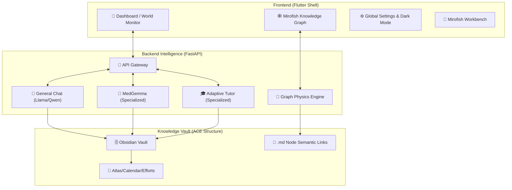

<div align="center">
  
  <h1>🤖 Cyborg AGI: The Autonomous Intelligence OS</h1>
  <p><strong>A Sleek, Stable, and High-Performance Local AGI Platform for Windows & Android</strong></p>

  <p>
    
    
    
    
    
  </p>

  
</div>

---

## 🌎 World Monitor: Live Geopolitical Intelligence
The **World Monitor Dashboard** provides a real-time, AI-driven overview of global events, connecting live intelligence feeds directly to your AGI context.

*   **🛰️ Real-time Map Integration**: Visualize conflict zones, instability hotspots, and natural disasters via a high-performance vector map.
*   **📊 AI-Driven Briefing**: Automated synthesis of global news, markets, and risk indicators into concise, actionable daily briefings.
*   **📉 Instability Scoring**: Proprietary scoring for country-level stability, combining GDELT events, USGS earthquake data, and military movements.
*   **📡 Live Intelligence Feeds**: Low-latency news tickers and strategic risk overviews updated every 5 minutes.

---

## 📱 Device Manager & Integrated Explorer
Cyborg now features a robust **Device Manager** that serves as the hub for your local neural network.

*   **🔍 mDNS Discovery**: Automatically detect and connect to other Cyborg-enabled devices on your local network for distributed inference.
*   **📂 Integrated File Explorer**: A built-in, togglable sidebar explorer allows you to navigate your **Knowledge Vault** (Brain) without leaving the dashboard.
*   **📊 Remote Metrics**: Monitor CPU, RAM, and GPU usage across all connected nodes in real-time.
*   **⚡ One-Click Ingestion**: Instantly add remote device assets or files into your knowledge graph ingestion queue.

## 🏗️ The "Core Brain" Architecture
Cyborg's intelligence is centralized in an **Obsidian-compatible** vault directory structure, enforced by the **ACE Synthesis Framework**.



---

## 🕸️ Mirofish Knowledge Graph: Active Semantic Visualization
Cyborg's knowledge representation is now powered by a **Force-Directed Physics Engine** inspired by Mirofish and Obsidian.

*   **⚡ Real-time Simulation**: Nodes (markdown files) and edges (wikilinks) are managed by a physical repulsion/attraction engine that clusters related topics naturally.
*   **⚙️ Expandable Sidebar Controls**: Adjust **Repel Force**, **Center Gravity**, and visual aesthetics (Node Size, Link Thickness) in real-time without overlapping the graph.
*   **🖱️ Interactive Exploration**: Drag nodes to pin them or click for a **Floating Node Details** view (Mirofish-style) that connects directly to the Vault.
*   **🎨 Dynamic Aesthetics**: Arrow-edged straight links, community-based color coding (Leiden detection), and optimized canvas rendering for thousands of nodes.
*   **🔍 Semantic Clustering**: During ingestion, Cyborg extracts triplets and creates explicit `[[Wikilinks]]`, which the physics engine uses to form clusters of related knowledge.

---

## 🧠 Gemma 4 Specialized Tracks: Domain-Specific Intelligence
Cyborg leverages **Gemma 4** for specialized, safety-aligned tasks that run in isolation from the general-purpose chat model.

### 🏥 Health Track: MedGemma 4B
*   **Isolated Pipeline**: Uses a dedicated **MedGemma 4B** model for clinical reasoning.
*   **Vision-Language Analysis**: Integrated **SigLIP Vision Encoder** for analyzing chest X-rays locally.
*   **EHR Safety**: FHIR-compatible function calling with hardcoded ethical guardrails.

### 🎓 Education Track: Adaptive Tutor
*   **Multimodal Grading**: OCR-powered homework evaluation using specialized Gemma weights.
*   **Adaptive Assessments**: Dynamically generates quizzes that target specific knowledge gaps identified during grading.
*   **Cultural Relevance**: Supports localized contexts (India, US, SE Asia) for more relatable teaching examples.

---

## 🛠️ Global System Features
*   **🌓 Persistent Dark Mode**: High-contrast dark theme supported across all screens, persisted via local Hive storage.
*   **⚙️ Integrated Settings**: Centralized configuration for LLM backends, UI preferences, and sync credentials.
*   **🚀 Windows Native Performance**: Hardened build pipeline resolving engine initialization (AOT/JIT) and path integrity.
*   **📊 Progress Tracking**: Learning path optimization and analytics dashboard
*   **🎯 Adaptive Quizzes**: Dynamically generated assessments based on student performance

### 🚀 Quick Start

```bash
# Run Health Demo (Port 7860)
python assets/demos/health_demo.py

# Run Education Demo (Port 7861)
python assets/demos/education_demo.py

# Deploy to Edge Device (Raspberry Pi / Jetson / Android)
bash scripts/deploy_gemma4_edge.sh
```

### 📚 Documentation

See [`GEMMA4_QUICKSTART.md`](GEMMA4_QUICKSTART.md) for complete architecture diagrams, API references, and benchmark results.

### 📦 Module Structure

```
lib/
├── health/
│   └── medgemma/
│       ├── inference.py      # X-ray analysis pipeline
│       ├── prompts.py        # Medical templates & disclaimers
│       └── ehr_functions.py  # FHIR function calling
└── education/
    └── adaptive_tutor/
        ├── grader.py         # Homework evaluation
        ├── quiz_generator.py # Adaptive assessments
        └── progress_tracker.py # Learning analytics
```

---

## 🎙️ Voice Assistant (Jarvis Engine)
Inspired by premium AGI interfaces, the Jarvis engine provides zero-latency speech.

-   **🎙️ STT (Whisper)**: Accurate, local voice recognition.
-   **🔊 TTS (Kokoro/ONNX)**: High-fidelity, emotion-aware voice synthesis.
-   **⚡ Interrupt Support**: Instantly stop AI speech by speaking or typing.

---

## 🔥 Plug & Play Firebase Setup System

Cyborg features an **automated Firebase initialization system** that enables instant configuration across your entire project.

### ⚡ Quick Start Procedure (Copy-Paste Commands)

Follow these exact steps to configure Firebase:

#### Step 1: Install Firebase CLI (if not already installed)
```bash
npm install -g firebase-tools
```

#### Step 2: Run FlutterFire Configuration
```bash
dart pub global run flutterfire_cli:flutterfire configure
```

When prompted:
- Select **"no"** if asked to reuse existing `firebase.json` values
- Choose your Firebase project from the list
- Select platforms: **android, ios, macos, web, windows** (use arrow keys + space to select)

#### Step 3: Download google-services.json
1. Go to [Firebase Console](https://console.firebase.google.com/)
2. Select your project → **Project Settings**
3. Under **Your apps**, select the Android app
4. Download `google-services.json`
5. Place it in: `android/app/google-services.json`

#### Step 4: Run the Auto-Sync Script
```bash
python sync_firebase.py
```

#### Step 5: Get Dependencies and Run
```bash
flutter pub get
flutter run -d windows
```

### 🔄 What It Does

*   **📦 Auto-Detection**: Reads your Firebase package name directly from `google-services.json`
*   **🔧 Package Sync**: Automatically applies the correct package name across your entire Android project using `change_app_package_name`
*   **⚙️ Dependency Installation**: Installs required Flutter dependencies automatically
*   **🔁 Hot-Swap Ready**: Replace `google-services.json` anytime and re-run the script for instant reconfiguration

### 🎯 Benefits

*   **Zero Manual Configuration**: No need to manually update `build.gradle`, `AndroidManifest.xml`, or directory structures
*   **Multi-Environment Support**: Easily switch between development, staging, and production Firebase projects
*   **Team-Friendly**: New team members can initialize their local environment in seconds

### 📋 Complete Setup Checklist

```bash
# 1. Install Firebase CLI
npm install -g firebase-tools

# 2. Configure FlutterFire
dart pub global run flutterfire_cli:flutterfire configure

# 3. Place google-services.json in android/app/

# 4. Run auto-sync
python sync_firebase.py

# 5. Install dependencies
flutter pub get

# 6. Launch the app
flutter run -d windows
```

---

## 🐳 Docker Containerization & Docker Hub Deployment

Cyborg can be containerized for consistent deployment across different environments. The Docker setup provides a production-ready backend service with persistent storage and health monitoring, with full support for building, pushing, and deploying images to Docker Hub.

### 📋 Prerequisites

- Docker Desktop (Windows/Mac) or Docker Engine (Linux)
- Docker Compose v2.0+
- Docker Hub account (for pushing images)

### 🚀 Quick Start with Docker

#### Option 1: Build and Run with Docker Compose (Recommended for Local Development)

```bash
# Copy the environment file and configure it
cp .env.example .env
# Edit .env with your Firebase credentials and settings

# Build and start the container
docker-compose up --build

# Run in detached mode (background)
docker-compose up -d --build
```

#### Option 2: Manual Docker Commands

```bash
# Build the image
docker build -t cyborg-backend:latest .

# Run the container
docker run -d \
  --name cyborg-backend \
  -p 8765:8765 \
  -v cyborg-data:/app/data \
  -v cyborg-models:/app/models \
  -v cyborg-config:/app/config \
  --env-file .env \
  cyborg-backend:latest
```

### 🐳 Docker Hub Management

Cyborg includes an automated script (`docker-hub.sh`) to streamline the process of building, tagging, pushing, and deploying images to Docker Hub.

#### Using the Docker Hub Script

```bash
# Make the script executable (if not already)
chmod +x docker-hub.sh

# View help
./docker-hub.sh help

# Log in to Docker Hub
./docker-hub.sh login

# Build image with specific tag
./docker-hub.sh build v1.0.0

# Push image to Docker Hub
./docker-hub.sh push v1.0.0

# Complete workflow: build and push
./docker-hub.sh all v1.0.0

# Deploy from Docker Hub (pull and run)
./docker-hub.sh deploy v1.0.0
```

#### Manual Docker Hub Workflow

If you prefer manual commands:

```bash
# 1. Log in to Docker Hub
docker login

# 2. Build the image with your Docker Hub username
docker build -t your-username/cyborg-agi-backend:latest .

# 3. Tag the image (if needed)
docker tag your-username/cyborg-agi-backend:latest your-username/cyborg-agi-backend:v1.0.0

# 4. Push to Docker Hub
docker push your-username/cyborg-agi-backend:latest
docker push your-username/cyborg-agi-backend:v1.0.0

# 5. Verify on Docker Hub
# Visit: https://hub.docker.com/r/your-username/cyborg-agi-backend
```

#### Pulling and Running from Docker Hub

```bash
# Pull the image
docker pull your-username/cyborg-agi-backend:latest

# Run the container
docker run -d \
  --name cyborg-backend \
  --restart unless-stopped \
  -p 8765:8765 \
  --env-file .env \
  -v cyborg-data:/app/data \
  -v cyborg-models:/app/models \
  your-username/cyborg-agi-backend:latest
```

### ⚙️ Configuration Options

#### Environment Variables

Create a `.env` file in the project root by copying `.env.example`:

```bash
cp .env.example .env
```

Then edit `.env` with your values:

```bash
# Firebase Configuration
FIREBASE_PROJECT_ID=******
FIREBASE_SERVICE_ACCOUNT_PATH=config/firebase-service-account.json

# LLM Settings
DEFAULT_MODEL=qwen2.5-coder-14b
CONTEXT_LENGTH=4096
N_GPU_LAYERS=-1

# Embeddings
EMBEDDING_MODEL=all-MiniLM-L6-v2
EMBEDDING_DEVICE=cpu

# Features
ENABLE_VOICE=true
ENABLE_WORLD_MONITOR=true
OFFLINE_MODE=false
```

#### Volume Mounts

The Docker setup includes persistent volumes for:
- **Data Storage**: `cyborg-data` volume stores database and application data
- **Models**: `cyborg-models` volume stores LLM models
- **Configuration**: `cyborg-config` volume stores Firebase and other configs

### 🌐 Accessing the Application

Once running, the backend API is available at:
- **API Endpoint**: `http://localhost:8765`
- **Health Check**: `http://localhost:8765/api/v1/health`
- **API Documentation**: `http://localhost:8765/api/docs`
- **ReDoc**: `http://localhost:8765/api/redoc`

### 🔧 Advanced Docker Commands

```bash
# View running containers
docker-compose ps

# View logs
docker-compose logs -f cyborg-backend

# Stop containers
docker-compose down

# Stop and remove volumes (⚠️ deletes data)
docker-compose down -v

# Rebuild without cache
docker-compose build --no-cache

# Execute commands inside container
docker exec -it cyborg-backend bash

# Check container health
docker inspect --format='{{.State.Health.Status}}' cyborg-backend
```

### 🎮 GPU Support (NVIDIA)

For GPU acceleration with CUDA support, uncomment the GPU section in `docker-compose.yml`:

```yaml
deploy:
  resources:
    reservations:
      devices:
        - driver: nvidia
          count: all
          capabilities: [gpu]
```

Then run with:
```bash
docker-compose up --build
```

Note: Requires NVIDIA Docker runtime and compatible GPU drivers.

### 📊 Resource Management

The default configuration limits resources:
- **CPU**: 4 cores max, 2 cores reserved
- **Memory**: 4GB max, 2GB reserved

To customize, edit `docker-compose.yml`:
```yaml
deploy:
  resources:
    limits:
      cpus: '8.0'    # Increase CPU limit
      memory: 8G     # Increase memory limit
```

### 🔒 Security Considerations

- Container runs as non-root user (`cyborg`, UID 1000)
- Sensitive data should be passed via environment variables, not baked into image
- Enable Docker secrets for production deployments
- Never commit `.env` file to version control
- Use specific version tags in production instead of `latest`

### 🔍 Troubleshooting

#### Build Failures
```bash
# Clear Docker cache
docker builder prune -a

# Rebuild from scratch
docker-compose build --no-cache --pull
```

#### Permission Issues
```bash
# Fix volume permissions
docker run --rm -v cyborg-data:/data alpine chown -R 1000:1000 /data
```

#### Health Check Failing
```bash
# Check container logs
docker-compose logs cyborg-backend

# Verify the container is running
docker-compose ps

# Test health endpoint manually
curl http://localhost:8765/api/v1/health
```

#### Docker Hub Authentication Issues
```bash
# Log out and log back in
docker logout
docker login

# Or use access token
docker login -u your-username -p your-access-token
```

#### Image Not Found on Docker Hub
```bash
# Verify image name and tag
docker images | grep cyborg

# Check Docker Hub repository visibility
# Private repos require authentication
docker login
```

---

## 🛠️ Installation & Windows Optimization

### 🐍 Backend (Python 3.10+)
```bash
cd assets/backend
python setup_env.py
```

### 📱 Frontend (Flutter 3.x)
```bash
flutter pub get
flutter run -d windows
```

---

<div align="center">
  <p><i>"Stable Intelligence. Autonomous Growth."</i></p>
  

  <p>
    <a href="https://github.com/ankit/Cyborg"></a>
  </p>
</div>
