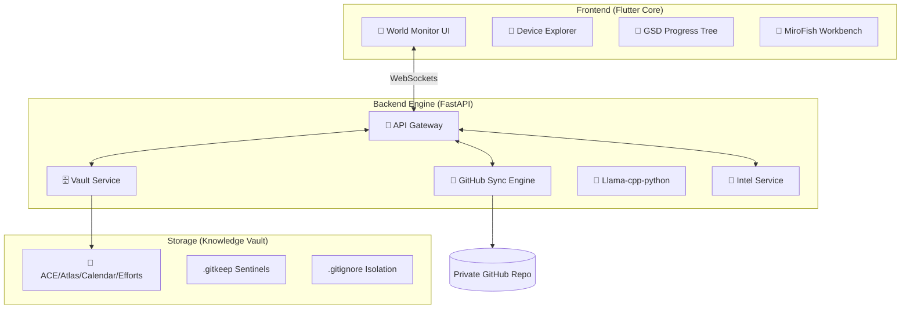

<div align="center">
  
  <h1>🤖 Cyborg AGI: The Autonomous Intelligence OS</h1>
  <p><strong>A Sleek, Stable, and High-Performance Local AGI Platform for Windows & Android</strong></p>

  <p>
    
    
    
    
  </p>

  
</div>

---

## 🌎 World Monitor: Live Geopolitical Intelligence
The **World Monitor Dashboard** provides a real-time, AI-driven overview of global events, connecting live intelligence feeds directly to your AGI context.

*   **🛰️ Real-time Map Integration**: Visualize conflict zones, instability hotspots, and natural disasters via a high-performance vector map.
*   **📊 AI-Driven Briefing**: Automated synthesis of global news, markets, and risk indicators into concise, actionable daily briefings.
*   **📉 Instability Scoring**: Proprietary scoring for country-level stability, combining GDELT events, USGS earthquake data, and military movements.
*   **📡 Live Intelligence Feeds**: Low-latency news tickers and strategic risk overviews updated every 5 minutes.

---

## 📱 Device Manager & Integrated Explorer
Cyborg now features a robust **Device Manager** that serves as the hub for your local neural network.

*   **🔍 mDNS Discovery**: Automatically detect and connect to other Cyborg-enabled devices on your local network for distributed inference.
*   **📂 Integrated File Explorer**: A built-in, togglable sidebar explorer allows you to navigate your **Knowledge Vault** (Brain) without leaving the dashboard.
*   **📊 Remote Metrics**: Monitor CPU, RAM, and GPU usage across all connected nodes in real-time.
*   **⚡ One-Click Ingestion**: Instantly add remote device assets or files into your knowledge graph ingestion queue.

---

## 🏗️ The "Core Brain" Architecture
Cyborg's intelligence is centralized in an **Obsidian-compatible** vault directory structure, enforced by the **ACE Synthesis Framework**.



---

## 📡 API Reference: The Cyborg Nexus

### 🌍 Intelligence & World Monitor
| Endpoint | Type | Description |
|:---|:---|:---|
| `/api/v1/intel/news` | `GET` | Fetches consolidated GDELT/USGS intelligence feeds |
| `/api/v1/intel/scores` | `GET` | Returns country-level instability and risk indices |

### 🗄️ Knowledge Vault & Sync
| Endpoint | Type | Description |
|:---|:---|:---|
| `/api/v1/vault/notes` | `GET` | Lists all files in the **Brain** (ACE Structure) |
| `/api/v1/vault/note/{path}` | `PUT` | Updates/Creates a note with automatic backlink updates |
| `/api/v1/github/sync` | `POST` | Triggers a queue-based sync with retry logic |

### 💬 Chat & Inference
| Endpoint | Type | Description |
|:---|:---|:---|
| `/api/v1/chat/stream` | `WS` | Real-time token streaming with GPU offload detection |
| `/api/v1/models/load` | `POST` | Dynamically swaps LLM (Qwen 2.5 / Llama 3) |

---

## 🔗 GitHub Synchronization Engine
Cyborg enforces a **Local-First, Privacy-Preserving** sync strategy.

-   **ACE Framework**: Automated directory enforcement (`Atlas`, `Calendar`, `Efforts`).
-   **Structure Mirroring**: Uses `.gitkeep` sentinel files to ensure empty directory structures are preserved on remote repos.
-   **Strict Isolation**: Personal knowledge data is decoupled from the application source code via `.gitignore`, preventing accidental leaks.
-   **Resilient Sync**: Background worker with queue-based retry logic and 403-permission remediation.

---

## 🎙️ Voice Assistant (Jarvis Engine)
Inspired by premium AGI interfaces, the Jarvis engine provides zero-latency speech.

-   **🎙️ STT (Whisper)**: Accurate, local voice recognition.
-   **🔊 TTS (Kokoro/ONNX)**: High-fidelity, emotion-aware voice synthesis.
-   **⚡ Interrupt Support**: Instantly stop AI speech by speaking or typing.

---

## 🔥 Plug & Play Firebase Setup System

Cyborg features an **automated Firebase initialization system** that enables instant configuration across your entire project.

### ⚡ Quick Start Procedure (Copy-Paste Commands)

Follow these exact steps to configure Firebase:

#### Step 1: Install Firebase CLI (if not already installed)
```bash
npm install -g firebase-tools
```

#### Step 2: Run FlutterFire Configuration
```bash
dart pub global run flutterfire_cli:flutterfire configure
```

When prompted:
- Select **"no"** if asked to reuse existing `firebase.json` values
- Choose your Firebase project from the list
- Select platforms: **android, ios, macos, web, windows** (use arrow keys + space to select)

#### Step 3: Download google-services.json
1. Go to [Firebase Console](https://console.firebase.google.com/)
2. Select your project → **Project Settings**
3. Under **Your apps**, select the Android app
4. Download `google-services.json`
5. Place it in: `android/app/google-services.json`

#### Step 4: Run the Auto-Sync Script
```bash
python sync_firebase.py
```

#### Step 5: Get Dependencies and Run
```bash
flutter pub get
flutter run -d windows
```

### 🔄 What It Does

*   **📦 Auto-Detection**: Reads your Firebase package name directly from `google-services.json`
*   **🔧 Package Sync**: Automatically applies the correct package name across your entire Android project using `change_app_package_name`
*   **⚙️ Dependency Installation**: Installs required Flutter dependencies automatically
*   **🔁 Hot-Swap Ready**: Replace `google-services.json` anytime and re-run the script for instant reconfiguration

### 🎯 Benefits

*   **Zero Manual Configuration**: No need to manually update `build.gradle`, `AndroidManifest.xml`, or directory structures
*   **Multi-Environment Support**: Easily switch between development, staging, and production Firebase projects
*   **Team-Friendly**: New team members can initialize their local environment in seconds

### 📋 Complete Setup Checklist

```bash
# 1. Install Firebase CLI
npm install -g firebase-tools

# 2. Configure FlutterFire
dart pub global run flutterfire_cli:flutterfire configure

# 3. Place google-services.json in android/app/

# 4. Run auto-sync
python sync_firebase.py

# 5. Install dependencies
flutter pub get

# 6. Launch the app
flutter run -d windows
```

---

## 🐳 Docker Containerization

Cyborg can be containerized for consistent deployment across different environments. The Docker setup provides both GUI and headless modes.

### 📋 Prerequisites

- Docker Desktop (Windows/Mac) or Docker Engine (Linux)
- Docker Compose v2.0+
- For GUI mode: X11 server (Linux) or VNC viewer

### 🚀 Quick Start with Docker

#### Option 1: Build and Run with Docker Compose (Recommended)

```bash
# Build and start the container
docker-compose up --build

# Or run with GUI support (starts VNC viewer)
docker-compose --profile gui up --build
```

#### Option 2: Manual Docker Commands

```bash
# Build the image
docker build -t cyborgai:latest .

# Run with GUI support (Linux)
export DISPLAY=:0
docker run -it --rm \
  -e DISPLAY=$DISPLAY \
  -v /tmp/.X11-unix:/tmp/.X11-unix:rw \
  -v cyborgai-data:/home/cyborg/.local/share \
  -p 5900:5900 \
  --name cyborgai \
  cyborgai:latest

# Run in headless mode (no GUI)
docker run -it --rm \
  -v cyborgai-data:/home/cyborg/.local/share \
  -p 8080:80 \
  --name cyborgai-headless \
  cyborgai:latest
```

### 🔧 Configuration Options

#### Environment Variables

Create a `.env` file in the project root:

```bash
# Firebase Configuration
FIREBASE_API_KEY=your_api_key
FIREBASE_APP_ID=your_app_id
FIREBASE_PROJECT_ID=your_project_id
FIREBASE_MESSAGING_SENDER_ID=your_sender_id

# Display Settings (for GUI mode)
DISPLAY=:0
QT_X11_NO_MITSHM=1
```

Then load with Docker Compose:
```bash
docker-compose --env-file .env up --build
```

#### Volume Mounts

The Docker setup includes persistent volumes for:
- **Application Data**: `cyborgai-data` volume stores user data and settings
- **Logs**: `./docker-logs` directory on host maps to `/var/log` in container
- **X11 Socket**: Required for GUI display on Linux

### 🖥️ Accessing the Application

#### GUI Mode
1. **Direct Display** (Linux): The app window appears on your desktop
2. **VNC Access**: Connect to `localhost:5900` with any VNC client
3. **Web VNC**: Open `http://localhost:6080` in your browser (when using `--profile gui`)

#### Headless Mode
- **Web Version**: Access at `http://localhost:8080`
- **API Only**: Use the backend endpoints directly

### 🛠️ Advanced Docker Commands

```bash
# View running containers
docker-compose ps

# View logs
docker-compose logs -f cyborgai

# Stop containers
docker-compose down

# Stop and remove volumes (⚠️ deletes data)
docker-compose down -v

# Rebuild without cache
docker-compose build --no-cache

# Scale for multiple instances (headless only)
docker-compose up --scale cyborgai=3 -d

# Execute commands inside container
docker exec -it cyborgai-app bash

# Check container health
docker inspect --format='{{.State.Health.Status}}' cyborgai-app
```

### 📊 Resource Management

The default configuration limits resources:
- **CPU**: 2 cores max, 1 core reserved
- **Memory**: 2GB max, 1GB reserved

To customize, edit `docker-compose.yml`:
```yaml
deploy:
  resources:
    limits:
      cpus: '4.0'    # Increase CPU limit
      memory: 4G     # Increase memory limit
```

### 🔒 Security Considerations

- Container runs as non-root user (`cyborg`, UID 1000)
- X11 socket mounting requires trust (Linux only)
- Sensitive data should be passed via environment variables, not baked into image
- Enable Docker secrets for production deployments

### 🐛 Troubleshooting

#### GUI Not Showing
```bash
# Allow X11 connections (Linux)
xhost +local:docker

# Verify DISPLAY variable
echo $DISPLAY

# Check X11 socket is mounted
ls -la /tmp/.X11-unix
```

#### Permission Issues
```bash
# Fix volume permissions
docker run --rm -v cyborgai-data:/data alpine chown -R 1000:1000 /data
```

#### Build Failures
```bash
# Clear Docker cache
docker builder prune -a

# Rebuild from scratch
docker-compose build --no-cache --pull
```

### 📦 Alternative: Web-Only Deployment

For server deployments without GUI:

```bash
# Build web version
flutter build web --release

# Use nginx to serve
docker run -d -p 80:80 \
  -v $(pwd)/build/web:/usr/share/nginx/html \
  --name cyborgai-web \
  nginx:alpine
```

---

## 🛠️ Installation & Windows Optimization

### 🐍 Backend (Python 3.10+)
```bash
cd assets/backend
python setup_env.py
```

### 📱 Frontend (Flutter 3.x)
```bash
flutter pub get
flutter run -d windows
```

---

<div align="center">
  <p><i>"Stable Intelligence. Autonomous Growth."</i></p>
  

  <p>
    <a href="https://github.com/ankit/Cyborg"></a>
  </p>
</div>
